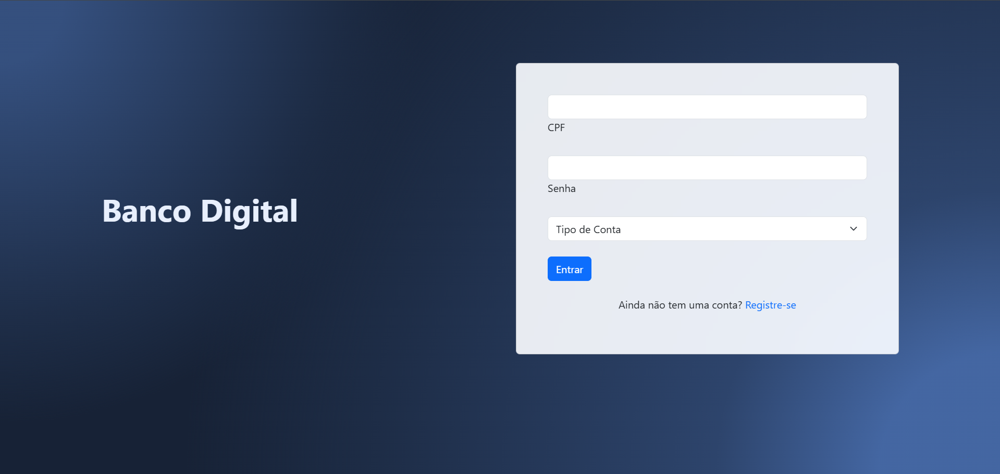
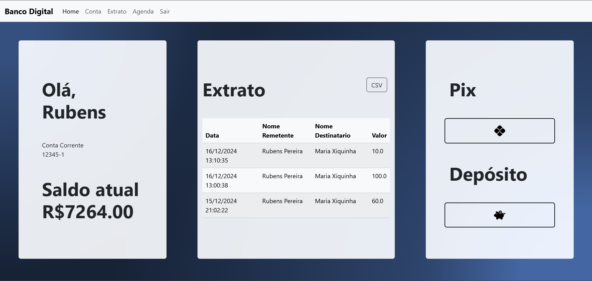
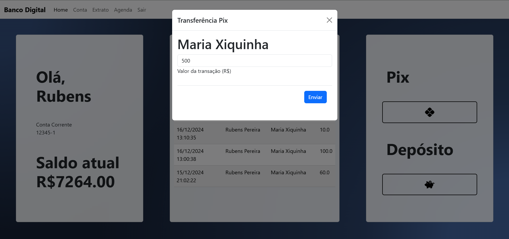
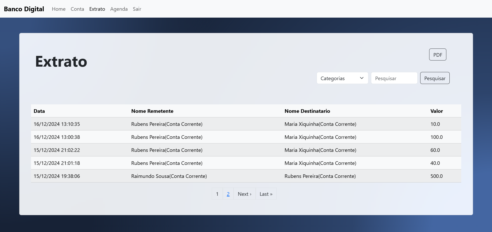

# Banco Digital

Este projeto foi desenvolvido como parte da disciplina de **Desenvolvimento Web**, onde aprendi sobre **Ruby** e **Ruby on Rails**. O objetivo principal era criar um banco digital funcional, e implementei as seguintes funcionalidades:

- Transferência via PIX;
- Extrato paginado;
- Depósito na conta poupança.

## 🛠️ Tecnologias e Ambiente de Desenvolvimento

- **Ruby**: Versão 3.3.6
- **Ruby on Rails**: Versão 7.1.5
- **Banco de Dados**: MySQL 8.0.40-0ubuntu0.22.04.1
- **Ambiente de Desenvolvimento**: VS Code + Ubuntu 22.04.5

## 💡 Sobre o Projeto

Este projeto foi um desafio muito enriquecedor, que me permitiu aplicar conceitos fundamentais de desenvolvimento web e explorar o ecossistema Ruby on Rails de forma prática.
