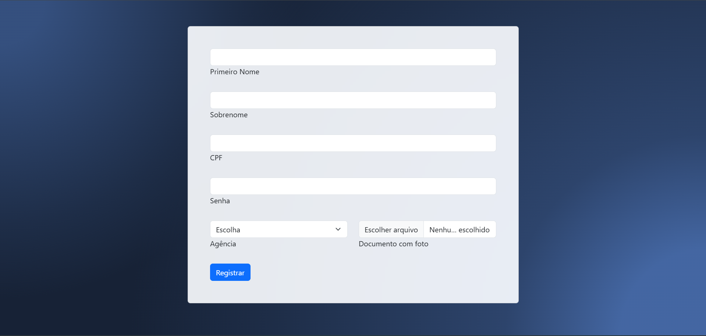

# Banco Digital

Este projeto foi desenvolvido como parte da disciplina de Desenvolvimento Web. O objetivo principal era criar um banco digital simples mas funcional e por exigência do professor tinha de ser feito com Ruby on Rails. Implementei as seguintes funcionalidades:

- Criação de conta através de tela de cadastro.
- Autenticação de usuário para acesso ao app.
- Transferência entre contas.
- Agendamento e extrato de pagamentos paginados.

## 🛠️ Tecnologias e Ambiente de Desenvolvimento

- **Ruby**: Versão 3.3.6
- **Ruby on Rails**: Versão 7.1.5
- **Banco de Dados**: MySQL 8.0.40-0ubuntu0.22.04.1
- **Ambiente de Desenvolvimento**: VS Code + Ubuntu 22.04.5

## 💡 Sobre o Projeto

Este projeto foi um desafio muito enriquecedor, que me permitiu aplicar conceitos fundamentais de desenvolvimento web e explorar o ecossistema Ruby on Rails de forma prática.
